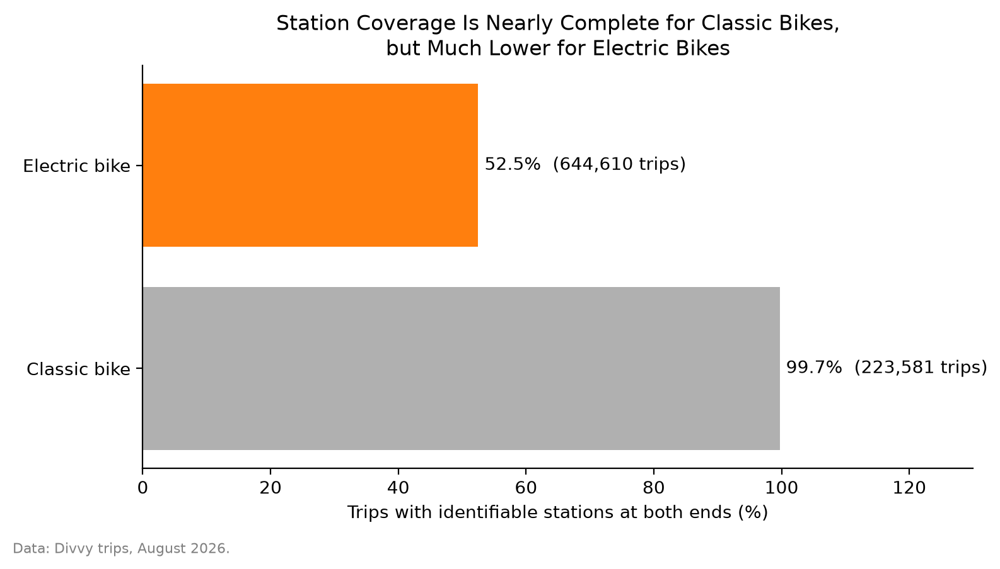
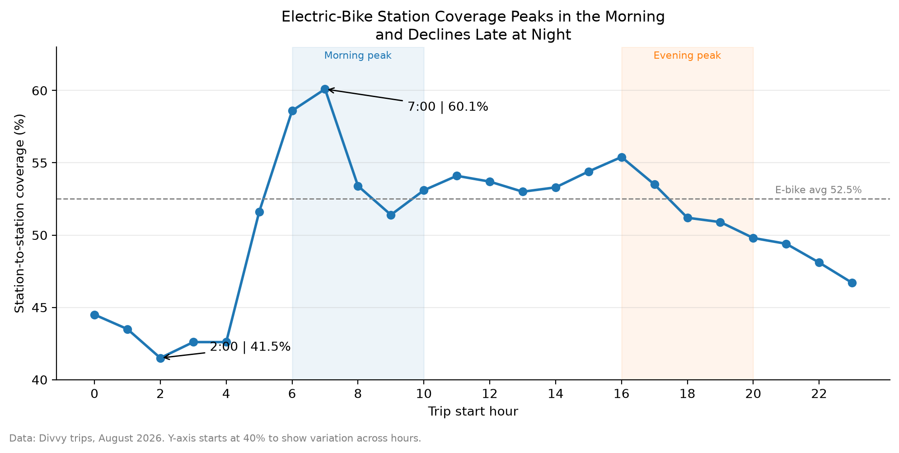
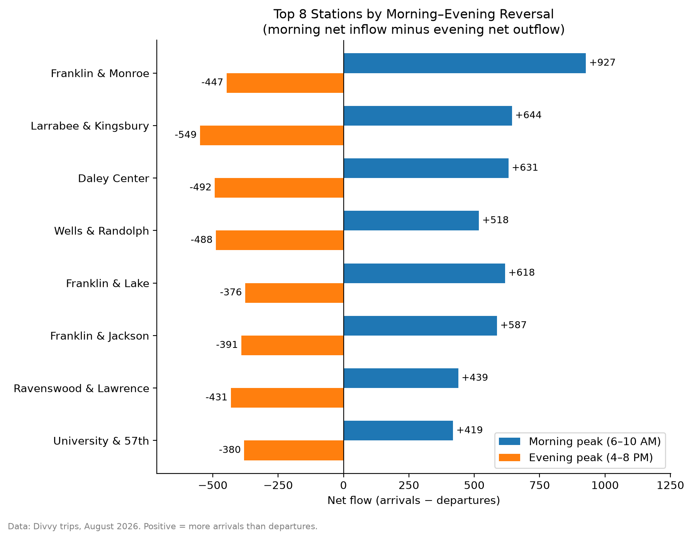

# Chicago Divvy Product & Operations Analytics

A SQL / DuckDB case study of 868K August 2026 Divvy trips, measuring how much activity station-based metrics actually capture, and where station-level directional flow reverses within the day.

## Key Takeaways

- **Station coverage differs sharply by bike type.** 99.7% of classic-bike trips have a station at both ends, versus 52.5% of electric-bike trips.
- **E-bike coverage varies by time of day**, from 41.5% (around 2 AM) to 60.1% (around 7 AM), so station-based metrics represent late-night e-bike activity less completely.
- **Monthly station balances mask strong intraday reversals.** Several stations with modest monthly net flow show large morning net inflow and large evening net outflow.

## Business / Analytical Question

1. What share of Divvy activity is captured by station-based metrics?
2. Among trips with identifiable stations, where and when does directional imbalance emerge?

## Data

- **Source:** [Divvy public trip data](https://divvybikes.com/system-data)
- **Period:** August 2026 (868,191 trips)
- **Fields used:** start/end timestamps, start/end station ID and name, bike type (`rideable_type`), rider type (`member_casual`)
- Raw CSV files and the local DuckDB database are not committed (see `.gitignore`).

## Analysis & Findings

### 1. Station Coverage Is a Measurement Issue

The project started as a basic data-quality audit. It found **189,327 trips with a missing start-station ID**. Rather than dropping them, I checked whether the missingness was systematically associated with bike type. It was highly structured: **all 189,327 were electric-bike trips**, while classic-bike station coverage was nearly complete.

That pattern is consistent with [Divvy's operating model](https://divvybikes.com/how-it-works/parking), where e-bikes are not strictly dock-to-dock. The public data does not include an explicit parking-type field for station-unidentified trips, so I treat these trips as a *coverage* limitation of station-based analysis, not as invalid records.

Station-to-station coverage: **99.7% classic, 52.5% electric, about 64.7% overall.**



Among the 644,610 e-bike trips:

| Station status | Trips | Share |
| --- | ---: | ---: |
| Station → Station | 338,441 | 52.5% |
| Station → no recorded end station | 116,842 | 18.1% |
| No recorded start station → Station | 108,941 | 16.9% |
| No recorded station at either end | 80,386 | 12.5% |

The share of e-bike activity missed depends on the metric. A departure-based analysis misses about 29.4% of e-bike trips, an arrival-based analysis about 30.6%, and an origin-destination analysis requiring both IDs excludes 47.5%.

### 2. E-Bike Coverage Changes by Time of Day

Rider type matters little: e-bike station-to-station coverage is 52.0% for members and 53.3% for casual riders. Weekday (53.7%) and weekend (50.1%) coverage are also fairly close.

Time of day shows a clearer pattern. Coverage peaks around 7 AM (60.1%) and is lowest around 2 AM (41.5%), with lower coverage late at night.



### 3. Station-Level Directional Flow

For each station I count **departures** (by `started_at`) and **arrivals** (by `ended_at`) and join the two:

```text
Net flow = arrivals - departures
```

Positive values mean more observed arrivals than departures; negative values mean more departures than arrivals.

Stations are aggregated by **station ID, not station name**. The same ID can appear under several name variants (for example `North Ave Beach` and `North Avenue Beach`), and grouping by name would split one station into several rows and distort the departure/arrival join.

At the monthly level, station net flows look relatively modest. Splitting the day into windows tells a different story.

### 4. Morning-Evening Reversal

I defined a morning peak (6:00–9:59 AM) and an evening peak (4:00–7:59 PM), then looked for stations with **positive morning net flow and negative evening net flow**. Reversal magnitude is the morning net flow minus the evening net flow.



The five strongest reversals (the figure above shows the top eight):

| Station | Morning net flow | Evening net flow | Reversal magnitude |
| --- | ---: | ---: | ---: |
| Franklin St & Monroe St | +927 | -447 | 1,374 |
| Larrabee St & Kingsbury St 1 | +644 | -549 | 1,193 |
| Daley Center Plaza | +631 | -492 | 1,123 |
| Wells St & Randolph St | +518 | -488 | 1,006 |
| Franklin St & Lake St | +618 | -376 | 994 |

These patterns are consistent with a commute-like temporal pattern, though trip purpose is not observed.

Absolute net flow naturally favors high-volume stations, so I also calculate a normalized **imbalance rate**:

```text
|arrivals - departures| / (arrivals + departures)
```

This separates absolute directional magnitude from relative imbalance. For example, University Ave & 57th St has a smaller absolute reversal (+419 / -380) but a 77.4% morning imbalance rate, meaning its morning flow was highly one-directional relative to its total activity.

## Operational Interpretation

- Station-based metrics underrepresent a substantial share of e-bike activity, so station-only analysis should be read with that coverage in mind.
- Intraday analysis reveals directional pressure that monthly totals hide.
- Net flow is a trip-based directional-flow indicator. It is not a measure of bike inventory, availability, or operator rebalancing.

## Limitations

- One month only (August 2026), so patterns may be summer-specific.
- No real-time bike inventory.
- No station capacity history.
- No operator rebalancing movements.
- No direct trip purpose.
- No explicit parking-type field for station-unidentified e-bike trips.

## Technical Approach

- Conditional aggregation (`CASE WHEN`) for coverage classification and period-level metrics
- CTEs to build departure and arrival aggregates separately
- `FULL OUTER JOIN` on station ID (and time period) so stations with only departures or only arrivals are kept
- Hour extraction from timestamps to define time windows; departures and arrivals bucketed by their own timestamps
- `COALESCE` / `NULLIF` for NULL handling and safe division
- Window functions (`ROW_NUMBER() OVER (PARTITION BY ...)` with `QUALIFY`) for per-period rankings
- Derived metrics: net flow, reversal magnitude, normalized imbalance rate

**Tools:** DuckDB / SQL, Python, Matplotlib

## Repository Structure

```text
.
├── sql/
│   ├── 00_load_raw_data.sql           # load CSV into DuckDB (trips_raw)
│   ├── 01_data_quality_audit.sql      # missing station fields by bike type
│   ├── 02_ebike_station_coverage.sql  # coverage by status, bike type, rider type, hour
│   ├── 03_station_imbalance.sql       # departures, arrivals, net flow by period
│   └── 04_station_reversal.sql        # morning-evening reversal + imbalance rate
├── outputs/
│   ├── 01_station_coverage_by_bike.png
│   ├── 02_ebike_station_coverage_by_hour.png
│   └── 03_morning_evening_reversal.png
├── run_sql.py                         # run a .sql file against divvy.duckdb
├── visualize.py                       # generate the three figures
├── requirements.txt
├── README.md
└── .gitignore
```

## Running the Project

Download the August 2026 trip CSV from the [Divvy data page](https://divvybikes.com/system-data) and place it in a local `data/` folder.

```bash
pip install -r requirements.txt

# 1. Load raw data into divvy.duckdb
python run_sql.py sql/00_load_raw_data.sql

# 2. Run any analysis script
python run_sql.py sql/02_ebike_station_coverage.sql

# 3. Regenerate figures into outputs/
python visualize.py
```

`run_sql.py` prints only the result of the last statement in a file, so run the numbered queries in `02` and `03` one at a time if you want to inspect each result.

## Possible Extensions

Multi-month or seasonal comparison, geographic visualization of station flows, or station-capacity and rebalancing data if available.
